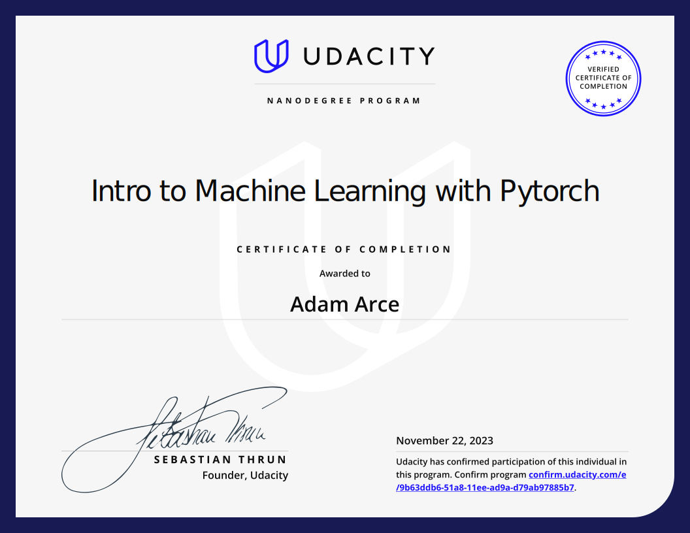

# Introduction to Machine Learning Nanodegree

The Udacity Nanodegree implements project-based learning. This directory is a collection of the three projects required. 

## Folder Structure

```bash

|-- README.md
|-- 01-Finding_Donors_Project/
|   |-- census.csv
|   |-- finding_donors.html
|   |-- finding_donors.ipynb  
|   |-- README.md
|   |-- visuals.py
|-- 02-Create_Your_Own_Image_Classifier/
|   |-- CIFAR_Image_Classifier.html
|   |-- CIFAR_Image_Classifier.ipynb
|   |-- data/
|   |-- final_model
|   |-- README.md
|-- 03-Identiy_Customer_Segments/
|   |-- Identify_Customer_Segments.html
|   |-- Identify_Customer_Segments.ipynb
|   |-- README.md

```

## Project 1: Find Donors for CharityML
### Supervised Learning

In this project, I apply supervised learning techniques on data collected for the US census to help CharityML (a fictitious charity organization) identify groups of people that are most likely to donate to their cause. Finding potential donors for a charity involves analyzing data about the US population and grouping that population by similar interests/traits that can help identify likely donors.

## Project 2: Create an Image Classifier`
### Neural Networks
I build and train a neural network using the deep learning framework, PyTorch. I define and train a neural network that learns to classify images; going from image data exploration to network training and evaluation.

## Project 3: Create Customer Segments with Arvato
### Unsupervised Learning
In this project, I investigate a real dataset of customers for a company, and apply several unsupervised learning techniques in order to segment customers into similar groups and extract information that may be used for marketing or product improvement.



